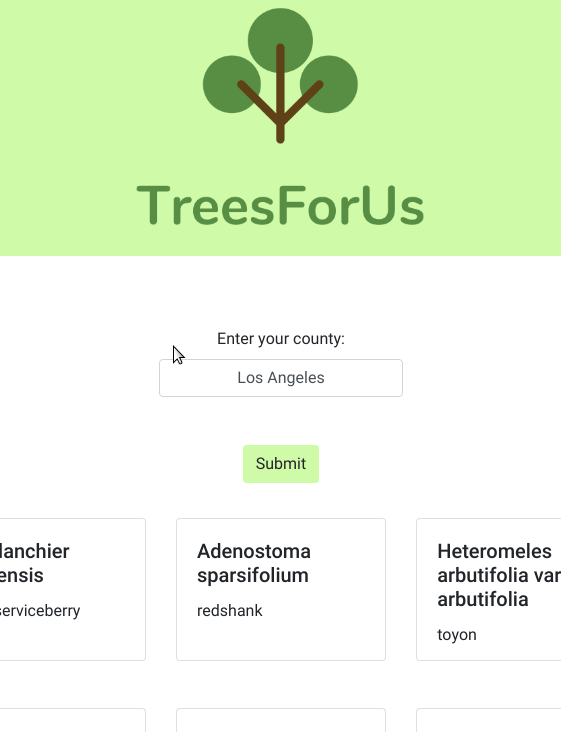

# TreesForUs App

Want to plant a tree? Don't know which tree is best for your location and climate? **TreesForUs** is a web app that suggests trees for the user to plant based on location and climate. It uses information from the govenrment's [plant database](https://plants.sc.egov.usda.gov/java/). With the adverse effects of climate change and air pollution planting trees will produce oxygen, intercept airborne particulates, and reduce smog. This will enhance a community's respiratory health. So plant some trees! Come check out our app demo down below!

This app was built during HackMIT 2020 with a group of sophomore computer science majors from UCLA! 

**Group Members:** Christian Aguilar, Itohan Ero, Sarah Mauricio

## How Does It Work?

TreesForUs works by:

* [x] Enter Location and Climate
* [x] Tree is Chosen based on Enviornment
* [x] Instructions on How to Plant the Tree will be Given to User

## Video Walkthrough

